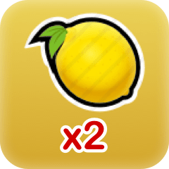

# Tobet FruitGame Verify

验证工具网页请访问：https://tobetone.github.io/FruitGame/

在使用此网页工具之前，请仔细阅读以下说明。你可以根据如下说明，自行开发程序验证。
## 开奖结果计算
  1. 根据游戏数据生成随机种子,并签名：  
    seed = GameId+BetPlayersCount+BetAmount*10000+LastBetTime;  
    seed_sign = sign(seed)  
  2. 对随机种子hash（SH256）运算，结果转换为16进制  
    hash_hex = hex(sha256(seed_sign))   
  3. 对hash_hex计算hashcode
  4. result = Abs(hashcode%220264) + 1
  5. <table style="text-align:center" width="100%">
                        <tr>
                            <td stype="width:25%">result<= </td>
                            <td stype="width:25%">结果</td>
                            <td stype="width:25%">result<= </td>
                            <td stype="width:25%">结果</td>
                        </tr>
                        <tr>
                            <td stype="width:25%">35242</td>
                            <td stype="width:25%"></td>
                            <td stype="width:25%">52024</td>
                            <td stype="width:25%"></td>
                        </tr>
                        <tr>
                            <td stype="width:25%">69645</td>
                            <td stype="width:25%"></td>
                            <td stype="width:25%">86427</td>
                            <td stype="width:25%"></td>
                        </tr>
                        <tr>
                            <td stype="width:25%">98174</td>
                            <td stype="width:25%"></td>
                            <td stype="width:25%">114956</td>
                            <td stype="width:25%"></td>
                        </tr>
                        <tr>
                            <td stype="width:25%">123767</td>
                            <td stype="width:25%"></td>
                            <td stype="width:25%">140549</td>
                            <td stype="width:25%"></td>
                        </tr>
                        <tr>
                            <td stype="width:25%">149360</td>
                            <td stype="width:25%"></td>
                            <td stype="width:25%">166142</td>
                            <td stype="width:25%"></td>
                        </tr>
                        <tr>
                            <td stype="width:25%">172016</td>
                            <td stype="width:25%"></td>
                            <td stype="width:25%">188798</td>
                            <td stype="width:25%"></td>
                        </tr>
                        <tr>
                            <td stype="width:25%">193203</td>
                            <td stype="width:25%"></td>
                            <td stype="width:25%">209985</td>
                            <td stype="width:25%"></td>
                        </tr>
                        <tr>
                            <td stype="width:25%">213509</td>
                            <td stype="width:25%"></td>
                            <td stype="width:25%">215271</td>
                            <td stype="width:25%"></td>
                        </tr>
                        <tr>
                            <td stype="width:25%">215605</td>
                            <td stype="width:25%"></td>
                            <td stype="width:25%">215772</td>
                            <td stype="width:25%"></td>
                        </tr>
                        <tr>
                            <td stype="width:25%">215922</td>
                            <td stype="width:25%"></td>
                            <td stype="width:25%">216122</td>
                            <td stype="width:25%"></td>
                        </tr>
                        <tr>
                            <td stype="width:25%">216247</td>
                            <td stype="width:25%"></td>
                            <td stype="width:25%">216272</td>
                            <td stype="width:25%"></td>
                        </tr>
                        <tr>
                            <td stype="width:25%">other</td>
                            <td stype="width:25%"></td>
                            <td stype="width:25%"></td>
                            <td stype="width:25%"></td>
                        </tr>
                    </table>

## 随机因子说明
   seed = GameId+BetPlayersCount+BetAmount*10000+LastBetTime
*  GameId:游戏ID
*  BetPlayersCount:参与游戏玩家个数
*  BetAmoun:本局游戏玩家总投注金额
*  LastBetTime:玩家的投注时间
## 签名验证
   验证签名使用Tobet的公钥（EOS6CG8VwJ8G1iFn6x781PMojmfD7i4kqqzsgd1AjWwAaEz35QGhn），对seed_sign进行ecc签名验证，验证结果通过即可证明随机种子未被篡改。
